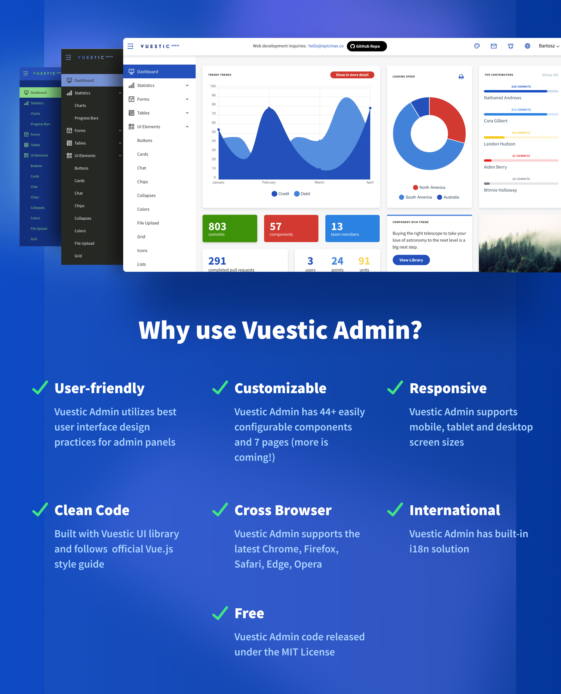
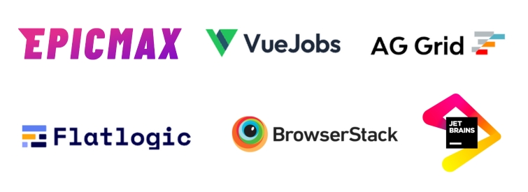

<p align="center">
  <a href="https://vuestic.dev" target="_blank">
    
  </a>
</p>

<p align="center">
  Free and beautiful Vue.js admin template with 44+ custom UI components.</br>
  Developed by  <a href="https://epicmax.co">Epicmax</a>.
  Designed by <a href="#">Vasili Savitski</a>
<br>
Based on <a href="https://github.com/epicmaxco/vuestic-ui">Vuestic UI</a> library.
</p>

<p align="center">
  <a href="https://admin.vuestic.dev/admin/dashboard?theme=light"> Light theme demo </a> | <a href="https://admin.vuestic.dev/admin/dashboard?theme=semi-dark">Semi-dark theme demo </a> | <a href="https://admin.vuestic.dev/admin/dashboard?theme=original">Original theme demo </a> | <a href="https://vuestic.dev"> Vuestic UI documentation </a>
</p>

> Vuestic Admin is built with Vuestic UI. See our
> <a href="https://github.com/epicmaxco/vuestic-ui/issues">issues</a>,
> <a href="https://vuestic.dev/en/contribution/guide">contributing guide</a> and join discussions on our
> <a href="https://discord.gg/jTKTjj2weV">discord server</a> to help us improve Vuestic Admin & Vuestic UI experience.

<p align="center">
  <a href="https://admin.vuestic.dev" target="_blank">
    
  </a>
</p>

<p align="center">
  <a href="https://circleci.com/gh/epicmaxco/vuestic-admin">
    
  </a>
</p>

### Documentation

Documentation, guides and tutorials are available
on <a href="https://vuestic.dev">vuestic.dev</a>

### Official Discord Server

Ask questions at the official
community [discord server](https://discord.gg/jTKTjj2weV)

### Installation

First of all, make sure you have all prerequisites installed:

- [Node.js](https://nodejs.org/en/) ( >=14.\*)
- [npm](https://www.npmjs.com/get-npm) version 3+ (
  or [yarn](https://yarnpkg.com/lang/en/docs/install) version 1.16+)
  and [Git](https://git-scm.com).

After checking the prerequisites, follow these simple steps to install and use
Vuestic Admin:

```
# clone the repo
$ git clone https://github.com/epicmaxco/vuestic-admin.git myproject

# go into app's directory and install dependencies:
$ cd myproject

```

Then, if you use npm:

```
$ npm install

# serve with hot reload at localhost:8080 by default.
$ npm run dev

# build for production
$ npm run build

# build for production and view the bundle analyzer report.
$ npm run build --report
```

If you use yarn:

```
$ yarn install

# serve with hot reload at localhost:8080 by default.
$ yarn dev

# build for production
$ yarn build

# build for production and view the bundle analyzer report.
$ yarn build --report
```

### Features

[Responsive layout](https://admin.vuestic.dev/admin/dashboard) |
[charts (Chart.js)](https://admin.vuestic.dev/admin/statistics/charts) |
[progress bars](https://admin.vuestic.dev/admin/statistics/progress-bars) |
[forms](https://admin.vuestic.dev/admin/forms/form-elements) |
[selects](https://admin.vuestic.dev/admin/forms/form-elements) |
[date pickers](https://admin.vuestic.dev/admin/forms/form-elements) |
[checkboxes and radios](https://admin.vuestic.dev/admin/forms/form-elements)
|
[static tables and data tables](https://admin.vuestic.dev/admin/tables/data)
|
[medium editor](https://admin.vuestic.dev/admin/forms/medium-editor) |
[smooth typography](https://admin.vuestic.dev/admin/ui/typography) |
[buttons](https://admin.vuestic.dev/admin/ui/buttons) |
[collapses](https://admin.vuestic.dev/admin/ui/collapses) |
[color pickers](https://admin.vuestic.dev/admin/ui/color-pickers) |
[timelines](https://admin.vuestic.dev/admin/ui/timelines) |
[toasts](https://admin.vuestic.dev/admin/ui/notifications) |
[tooltips](https://admin.vuestic.dev/admin/ui/popovers) |
[popovers](https://admin.vuestic.dev/admin/ui/popovers) |
[icons](https://admin.vuestic.dev/admin/ui/icons/) |
[spinners](https://admin.vuestic.dev/admin/ui/spinners) |
[modals](https://admin.vuestic.dev/admin/ui/modals) |
[file upload](https://admin.vuestic.dev/admin/ui/file-upload) |
[chips](https://admin.vuestic.dev/admin/ui/chips) |
[trees](https://admin.vuestic.dev/admin/ui/tree-view) |
[cards](https://admin.vuestic.dev/admin/ui/cards) |
[ratings](https://admin.vuestic.dev/admin/ui/rating) |
[sliders](https://admin.vuestic.dev/admin/ui/sliders) |
[chat](https://admin.vuestic.dev/admin/ui/chat) |
[maps (MapLibre, Yandex, Leaflet, amMap)](https://admin.vuestic.dev/admin/maps/maplibre-maps)
|
[login/signup pages templates](https://admin.vuestic.dev/auth/login) |
[404 pages templates](https://admin.vuestic.dev/admin/pages/404-pages) |
[i18n](https://admin.vuestic.dev/admin/dashboard)

### Browser Support

We design Vuestic Admin to support the latest modern web browsers.

| <br>Edge | <br>Firefox | <br>Chrome | <br>Safari | <br>Opera |
| ------------------------------------------------------------------------------------------------------------------------------------------------ | ------------------------------------------------------------------------------------------------------------------------------------------------------------ | -------------------------------------------------------------------------------------------------------------------------------------------------------- | -------------------------------------------------------------------------------------------------------------------------------------------------------- | ---------------------------------------------------------------------------------------------------------------------------------------------------- |
| Edge                                                                                                                                             | last 2 versions                                                                                                                                              | last 2 versions                                                                                                                                          | last 2 versions                                                                                                                                          | last 2 versions                                                                                                                                      |

### Contributing

Thanks for all your wonderful PRs, issues and ideas.

<a href="https://github.com/epicmaxco/vuestic-admin/graphs/contributors">

</a>
<br>

You’re always welcome to join: check out
our <a href="https://vuestic.dev/en/contribution/guide">
contribution guides</a>
, [open issues](https://github.com/epicmaxco/vuestic-ui/issues)
and [discord server](https://discord.gg/jTKTjj2weV)

### Partners & Sponsors ❤️



Become a partner: [hello@epicmax.co](mailto:hello@epicmax.co)

## Can I hire you guys?

[Epicmax](https://epicmax.co) is committed to Open Source from its beginning.
[Vuestic UI](https://vuestic.dev) was created and backed by Epicmax, and is supported through all the years.
You can request a consultation or order web development services by Epicmax via this [form](https://epicmax.co/contacts) 😎

Say hi: <a href="mailto:hello@epicmax.co">hello@epicmax.co</a>. We will be happy to work with you!

[Other work](https://epicmax.co) we’ve done 🤘

[Meet the Team](https://vuestic.dev/team)

### Awards

<a href="https://flatlogic.com/templates/vuestic-vue-free-admin" target="_blank">
    
</a>
<p>
  By <a href="https://flatlogic.com/templates/vuestic-vue-free-admin" target="_blank">@flatlogic</a> marketplace
</p>

### Follow us

Stay up to date with the latest Vuestic news! Follow us
on [Twitter](https://twitter.com/vuestic_ui)
or [Linkedin](https://www.linkedin.com/company/18509340)

### License

[MIT](https://github.com/epicmaxco/vuestic-admin/blob/master/LICENSE) license.
